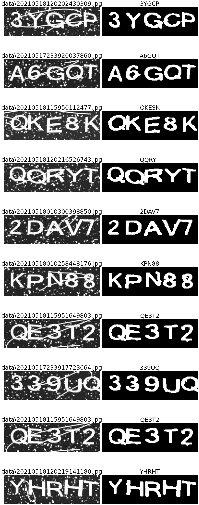

# TWSE Captcha Breaker

Recognize string from the captcha on TWSE daily report using Tesseract OCR.

##  Usage

[Follow the steps to install Tesseract](https://tesseract-ocr.github.io/tessdoc/Installation.html)

Download `eng.traineddata` for using legacy engine

Run `pip install -r requirements.txt`

Run `python captcha_to_string.py -h` to see the usage or import the `image_to_string()` function in your own script to use

Example:

```
# inference for one image
python captcha_to_string.py -i ./data/0001.jpg
# inference for all images in a directory
python captcha_to_string.py -d ./data
# specify a output file path
python captcha_to_string.py -d ./data -o ./my_res.txt
```

## Preprocess

- Using "Opening" to filter small noises on image

- Before converting image to binary, apply blurring on image for better filtering noises

- Convert image to binary

- Find connected components and remove relatively small ones

- Apply dilatation on image to make text bolder

## Tesseract

- Use `--psm 7` (Treat the image as a single text line.)

- Use `--oem 2`, `--oem 1` then `--oem 0` sequentially if length of output string is not equals to 5

## Result

